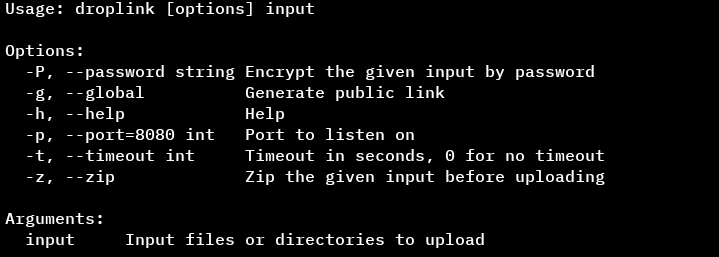

> **Choose, Upload, Download.**

Droplink is a command-line tool for sharing files and directories over HTTPs. It starts a local/public server and provides a URL that can be accessed from other devices on the same network or world-wide.


## Requirements

- [Go](https://go.dev), version 1.25 or newer.
- [Task](https://taskfile.dev), version 3 or newer.


## Building

```sh
git clone https://github.com/makestatic/droplink.git
cd droplink
task release
```

Or via installation script:

```sh
curl -fsSL https://raw.githubusercontent.com/makestatic/droplink/main/scripts/install.sh | bash -s
```


## Usage



### Example

Share a single file or directory:

```sh
droplink ./file.txt
```

Droplink will print a URL such as:

```
http://localhost:****
```

Open this URL in a web browser on the same network to download the file(s).


## Author

- [@makestatic](https://github.com/makestatic)
- [Comunity](https://github.com/makestatic/droplink/graphs/contributors)


## Contributing

Contributions are welcome, and we love them. You can help by:

- Reporting bugs  
- Suggesting improvements  
- Submitting patches or pull requests

Please follow these guidelines:

1. Fork the repository and make your changes in a separate branch.  
2. Write clear commit messages describing your changes.  
3. Ensure your changes do not break existing functionality.  
4. Submit a pull request for review.

For major changes, open an issue first to discuss what you plan to do.

See [CONTRIBUTING.md](CONTRIBUTING.md) for more details.

<br/>

```sh
Copyright (C) 2025 Ali Almalki

This program is free software: you can redistribute it and/or modify  
it under the terms of the GNU General Public License as published by the  
Free Software Foundation, either version 3 of the License, or  
(at your option) any later version.

This program is distributed in the hope that it will be useful,  
but WITHOUT ANY WARRANTY; without even the implied warranty of  
MERCHANTABILITY or FITNESS FOR A PARTICULAR PURPOSE. See the  
GNU General Public License for more details.

You should have received a copy of the GNU General Public License  
along with this program. If not, see <https://www.gnu.org/licenses/>.
```
